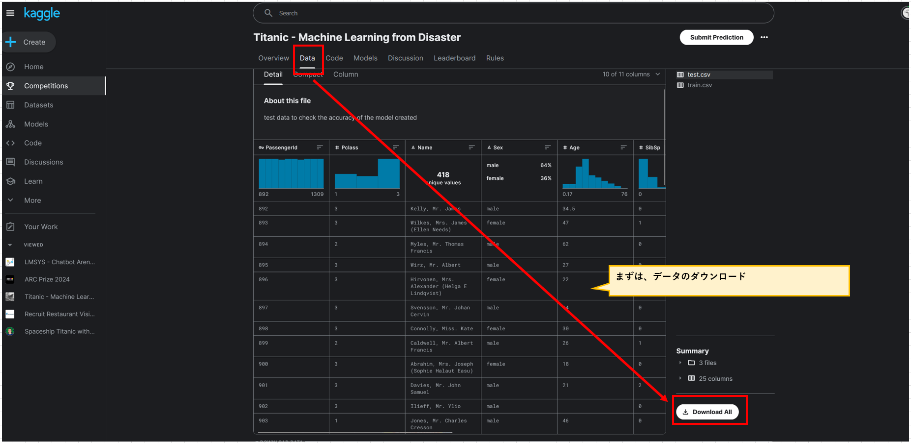
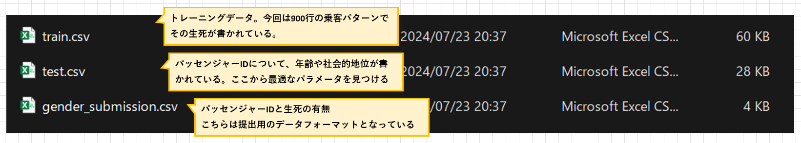

## はじめに

今回、Kaggleに登録したことに際してせっかくならコードを蓄積させていこうと考えている。  
Pythonはprint程度、numpy,pandasはインストールくらいの経験値なので、1つ1つ丁寧に確認する。

各ステップごとに、その状態のcodeを保存して積み上げていくイメージで作成していく。

今まで、前に書いた処理を何の目的で入れたか・もしくは入れたこと自体よく忘れてしまうことが多かった。
そのため、後で読み返すと一から読み返すくらい工数がかかる。

しかも、実践したことも忘れてることが多い。  
そうなると、やってきた実感もわかないというところで、コーディングを先延ばしにしていた。

今回は、そんな体質の人ために、1つ1つ積み上げていく実感を持つことで各ステップを記載していく。
## 参考文献
[Kaggle Titanic - Machine Learning from Disaster](https://www.kaggle.com/competitions/titanic)
[Codexa タイタニック号で生き残るのは誰？](https://www.codexa.net/kaggle-titanic-beginner/)

## 前提条件
Ubuntu
Python3 がインストール済
Python仮想環境について、頭で利用方法をイメージできる
numpyインストール済
pandasインストール済

## データの取得
まず、KaggleのCompetitionにアクセスしてデータを取得する。  



## データを見てみる
とりあえず、CSVを開いて見てみる。
概要は以下。  



## Loading and Displaying CSV
まず、こちらのCSVファイルをUbuntuサーバに格納する。
その後、Pythonコードで読み込み、表示させる。

### Python側にディレクトリ作成
今回の作業を行う用のディレクトリを作成する。
丁寧に作業をしていきたいので、1つ1つ確認しながら進めていきたい。

```
[実行コマンド]
mkdir /home/mainte/kaggle_tiganic

[ディレクトリ移動コマンド]
cd /home/mainte/kaggle_titanic
```

### csvファイルを保存する
ローカルPCでVMwareを使ってUbuntuサーバを立てているので、WinSCPかマウントすることでデータを転送する。
まず、カレントディレクトリ(/home/mainte/kaggle_titanic)内で「data」ディレクトリを作成。

今回、マウントポイントが/home/mainte/win_data/titanic である。
```
[実行コマンド]
ll /home/mainte/win_data/titanic/

[結果]
-rwxrwx--- 1 root vboxsf  3258 Jul 20 05:32 gender_submission.csv*
-rwxrwx--- 1 root vboxsf 28629 Jul 20 05:32 test.csv*
-rwxrwx--- 1 root vboxsf 61194 Jul 20 05:34 train.csv*
```
であり、これを今回利用するディレクトリにコピーする。

```
[実行コマンド]
cp -r /home/mainte/win_data/titanic/* /home/mainte/kaggle_titanic/data/


[確認コマンド]
ll /home/mainte/kaggle_titanic/data/

[結果]
-rwxrwx--- 1 root vboxsf  3258 Jul 20 05:32 gender_submission.csv*
-rwxrwx--- 1 root vboxsf 28629 Jul 20 05:32 test.csv*
-rwxrwx--- 1 root vboxsf 61194 Jul 20 05:34 train.csv*
```

また、現在、rootユーザもしくはvboxsfグループに所属しているユーザ以外はデータを参照できない。
そのため、ファイルの参照権限を変更する。
```
[実行コマンド]
chmod 777 /home/mainte/kaggle_titanic/data/*

[確認コマンド]
ll /home/mainte/kaggle_titanic/data/

[結果]
-rwxrwxrwx 1 mainte mainte  3258 Jul 23 12:29 gender_submission.csv*
-rwxrwxrwx 1 mainte mainte 28629 Jul 23 12:29 test.csv*
-rwxrwxrwx 1 mainte mainte 61194 Jul 23 12:29 train.csv*

```

### display csv

csvを表示するプログラムはこちら、[display_csv.py](./code/display_csv.py)

```
[実行コマンド]
git clone https://github.com/halchil/kaggle_titanic.git

[結果]
Cloning into 'kaggle_titanic'...
remote: Enumerating objects: 52, done.
remote: Counting objects: 100% (52/52), done.
remote: Compressing objects: 100% (35/35), done.
remote: Total 52 (delta 10), reused 48 (delta 9), pack-reused 0
Receiving objects: 100% (52/52), 427.37 KiB | 240.00 KiB/s, done.
Resolving deltas: 100% (10/10), done.
ll /home/mainte/kaggle_titanic/kaggle_titanic/code/display_csv.py 
-rw-rw-r-- 1 mainte mainte 473 Jul 23 13:46 /home/mainte/kaggle_titanic/kaggle_titanic/code/display_csv.py
```
仮想環境に入る。

```
[実行コマンド]
source myenv/bin/activate

[確認コマンド]
echo $VIRTUAL_ENV

[結果]
/home/mainte/myenv

```
`pip list`コマンドで利用可能なパッケージを表示してもいいが、さっそくPyhonのコードを実行する。

```
[実行コマンド]
python3 /home/mainte/kaggle_titanic/kaggle_titanic/code/display_csv.py 

[結果]
   PassengerId  Survived  Pclass                                               Name     Sex   Age  SibSp  Parch            Ticket     Fare Cabin Embarked
0            1         0       3                            Braund, Mr. Owen Harris    male  22.0      1      0         A/5 21171   7.2500   NaN        S
1            2         1       1  Cumings, Mrs. John Bradley (Florence Briggs Th...  female  38.0      1      0          PC 17599  71.2833   C85        C
2            3         1       3                             Heikkinen, Miss. Laina  female  26.0      0      0  STON/O2. 3101282   7.9250   NaN        S
3            4         1       1       Futrelle, Mrs. Jacques Heath (Lily May Peel)  female  35.0      1      0            113803  53.1000  C123        S
4            5         0       3                           Allen, Mr. William Henry    male  35.0      0      0            373450   8.0500   NaN        S
----- ----- ----- ----- ----- ----- ----- ----- ----- -----
   PassengerId  Pclass                                          Name     Sex   Age  SibSp  Parch   Ticket     Fare Cabin Embarked
0          892       3                              Kelly, Mr. James    male  34.5      0      0   330911   7.8292   NaN        Q
1          893       3              Wilkes, Mrs. James (Ellen Needs)  female  47.0      1      0   363272   7.0000   NaN        S
2          894       2                     Myles, Mr. Thomas Francis    male  62.0      0      0   240276   9.6875   NaN        Q
3          895       3                              Wirz, Mr. Albert    male  27.0      0      0   315154   8.6625   NaN        S
4          896       3  Hirvonen, Mrs. Alexander (Helga E Lindqvist)  female  22.0      1      1  3101298  12.2875   NaN        S
```
となり、`train.csv`と`test.csv`を表示することができた。

こちら、train.csvは学習用データなので「Survived」という項目がある。
一方で、test.csvはいわゆる問題用紙のようなもので、モデルを使ってSurvivedの有無を後で書く用のデータである。

(GitHubとのファイルのやり取りがめんどくさいので、マウントポイントなどを工夫してデータ移動工数を下げたい。)


## データの整備

続いて、データの整備を行う。
データの整備とは、欠損値を削除することで、計算等を行いやすくすることである。

デ＝他の整備は、簡単なようで奥が深い。
なぜなら、ただ単に欠損した値を削除するだけだと支障が出る場合がある。
例えば、ある列の半分くらいがNullだった場合などがそうである。

このような場合、Nullを平均値で置き換えるなどセンスが問われる部分が出てきてしまう。

このように、データの整備はただ単に実施する内容が決まっているものではなく臨機応変にデータを扱いやすくすることを言う。

そのため、ある人の考えがデータの内容に影響を及ぼすケースも少なくない。
そのような織り込まれた思想まで管理することができれば、よりよいデータ活用につながるだろう。

今回使うプログラムは、[delete_extra_data.py](./code/delete_extra_data.py)

### データの概要・代表的な値を確認

まずは、pandasのshape機能を使って、

```
[実行コマンド]
python3 /home/mainte/code/delete_extra_data.py 

[結果]
(891, 12)
(418, 11)
===== ===== ===== ===== ===== ===== ===== ===== ===== ===== ===== ===== ===== ===== 
<bound method NDFrame.describe of      PassengerId  Survived  Pclass                                               Name     Sex   Age  SibSp  Parch            Ticket     Fare Cabin Embarked
0              1         0       3                            Braund, Mr. Owen Harris    male  22.0      1      0         A/5 21171   7.2500   NaN        S
1              2         1       1  Cumings, Mrs. John Bradley (Florence Briggs Th...  female  38.0      1      0          PC 17599  71.2833   C85        C
2              3         1       3                             Heikkinen, Miss. Laina  female  26.0      0      0  STON/O2. 3101282   7.9250   NaN        S
3              4         1       1       Futrelle, Mrs. Jacques Heath (Lily May Peel)  female  35.0      1      0            113803  53.1000  C123        S
4              5         0       3                           Allen, Mr. William Henry    male  35.0      0      0            373450   8.0500   NaN        S
..           ...       ...     ...                                                ...     ...   ...    ...    ...               ...      ...   ...      ...
886          887         0       2                              Montvila, Rev. Juozas    male  27.0      0      0            211536  13.0000   NaN        S
887          888         1       1                       Graham, Miss. Margaret Edith  female  19.0      0      0            112053  30.0000   B42        S
888          889         0       3           Johnston, Miss. Catherine Helen "Carrie"  female   NaN      1      2        W./C. 6607  23.4500   NaN        S
889          890         1       1                              Behr, Mr. Karl Howell    male  26.0      0      0            111369  30.0000  C148        C
890          891         0       3                                Dooley, Mr. Patrick    male  32.0      0      0            370376   7.7500   NaN        Q

[891 rows x 12 columns]>
===== ===== ===== ===== ===== ===== ===== ===== ===== ===== ===== ===== ===== ===== 
<bound method NDFrame.describe of      PassengerId  Pclass                                          Name     Sex   Age  SibSp  Parch              Ticket      Fare Cabin Embarked
0            892       3                              Kelly, Mr. James    male  34.5      0      0              330911    7.8292   NaN        Q
1            893       3              Wilkes, Mrs. James (Ellen Needs)  female  47.0      1      0              363272    7.0000   NaN        S
2            894       2                     Myles, Mr. Thomas Francis    male  62.0      0      0              240276    9.6875   NaN        Q
3            895       3                              Wirz, Mr. Albert    male  27.0      0      0              315154    8.6625   NaN        S
4            896       3  Hirvonen, Mrs. Alexander (Helga E Lindqvist)  female  22.0      1      1             3101298   12.2875   NaN        S
..           ...     ...                                           ...     ...   ...    ...    ...                 ...       ...   ...      ...
413         1305       3                            Spector, Mr. Woolf    male   NaN      0      0           A.5. 3236    8.0500   NaN        S
414         1306       1                  Oliva y Ocana, Dona. Fermina  female  39.0      0      0            PC 17758  108.9000  C105        C
415         1307       3                  Saether, Mr. Simon Sivertsen    male  38.5      0      0  SOTON/O.Q. 3101262    7.2500   NaN        S
416         1308       3                           Ware, Mr. Frederick    male   NaN      0      0              359309    8.0500   NaN        S
417         1309       3                      Peter, Master. Michael J    male   NaN      1      1                2668   22.3583   NaN        C

[418 rows x 11 columns]>
```

データの代表的な

## 決定木での学習

